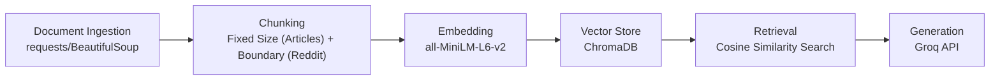

# Project 1 Planning: The Unofficial Guide

> Write this document before you write any pipeline code.
> Your spec and architecture diagram are what you'll use to direct AI tools (Claude, Copilot, etc.) to generate your implementation — the more specific they are, the more useful the generated code will be.
> Update the Retrieval Approach and Chunking Strategy sections if you change your approach during implementation.
> Update this file before starting any stretch features.

---

## Domain

<!-- What domain did you choose? Why is this knowledge valuable and hard to find through official channels? -->

This system makes student-generated survival advice for UC Berkeley searchable and accessible in one place. Rather than covering specific courses or professors, it consolidates lifestyle and mindset tips that reflect the lived experience of students — advice that is specific to Berkeley's environment and culture. This kind of knowledge is hard to access through official channels because it captures the more personal thoughts and experiences of students, typically scattered across Reddit threads, student blogs, campus newspaper articles, and online forums.

---

## Documents

<!-- List your specific sources: URLs, subreddit names, forum threads, or file descriptions.
     Aim for at least 10 sources that together cover different subtopics or perspectives within your domain. -->

| # | Source | Description | URL or location |
|---|--------|-------------|-----------------|
| 1 | Her Campus | An online platform written for and by college women. This article is written by a student writer from the Her Campus at UC Berkeley chapter. | https://www.hercampus.com/school/uc-berkeley/uc-berkeley-college-survival-guide/ |
| 2 | The Daily Californian | A survival guide written by a UC Berkeley student in the campus newspaper, focused on physical and mental wellbeing. | https://www.dailycal.org/archives/uc-berkeley-survival-guide-for-newer-students/article_5664df0b-aa7e-5076-8a5a-17be645aa5a9.html |
| 3 | Plexuss.com | A student network site featuring college survival guides, including this overview of Berkeley life. | https://plexuss.com/n/uc-berkeley-college-survival-guide |
| 4 | The Daily Californian | Written by a different student, a survival guide focused on habits and attitudes for academic success. | https://www.dailycal.org/archives/stay-motivated-a-uc-berkeley-survival-guide/article_f2a640cd-ea05-5e97-859d-e470df9401ae.html |
| 5 | Berkeley Subreddit | "What should every new Cal student know about before they come to campus this Fall?" — advice from upperclassmen on what they wish they had known. | https://www.reddit.com/r/berkeley/comments/1dqccmk/what_should_every_new_cal_student_know_about/ |
| 6 | Berkeley Subreddit | "Mental health resource guide and a student-to-student survival guide" — community-compiled mental health resources and personal advice. | https://www.reddit.com/r/berkeley/comments/16hgeb0/mental_health_resource_guide_and_a/ |
| 7 | Berkeley Subreddit | Covers the geography of Berkeley and practical safety tips for living in and around campus. | https://www.reddit.com/r/berkeley/comments/15njiw6/what_is_essential_to_haveknow_when_living_in/ |
| 8 | Berkeley Subreddit | Specific to the EECS major — advice on navigating challenging coursework and academic pressure. | https://www.reddit.com/r/berkeley/comments/25kp1d/how_to_survive_berkeley_eecs/ |
| 9 | Berkeley Subreddit | Advice on exams and finals, specifically how to study effectively when time is limited. | https://www.reddit.com/r/berkeley/comments/13c6atg/guide_to_maximizing_your_score_on_your_finals_if/ |
| 10 | Berkeley Subreddit | "How to Succeed at Berkeley" — general tips for navigating academic and social life at Cal. | https://www.reddit.com/r/berkeley/comments/pfa2j3/how_to_succeed_at_berkeley/ |

---

## Chunking Strategy

<!-- How will you split documents into chunks?
     State your chunk size (in tokens or characters), overlap size, and explain why those
     numbers fit the structure of your documents.
     A review-heavy corpus warrants different chunking than a long FAQ. -->

**Chunk size:**
This project uses an adaptive chunking strategy based on source type: approximately 450 tokens per chunk for articles, and one comment per chunk for Reddit threads.

**Overlap:**
75 tokens for articles; 0 for Reddit.

**Reasoning:**
Articles are continuous prose where ideas often span paragraph boundaries, so overlapping adjacent chunks prevents relevant context from being cut off at retrieval boundaries. Each Reddit comment is a self-contained unit of advice, making the comment boundary the natural chunk boundary — overlap is unnecessary.

---

## Retrieval Approach

<!-- Which embedding model are you using (e.g., all-MiniLM-L6-v2 via sentence-transformers)?
     How many chunks will you retrieve per query (top-k)?
     If you were deploying this for real users and cost wasn't a constraint, what tradeoffs
     would you weigh in choosing a different embedding model — context length, multilingual
     support, accuracy on domain-specific text, latency? -->

**Embedding model:**
`all-MiniLM-L6-v2` (handles conversational text quickly and accurately)

**Top-k:**
5 (increased from 3 after evaluation showed relevant chunks being edged out by noisy chunks; with cleaned data, k=5 surfaces the correct answer for more queries without introducing clearly distant results)

**Production tradeoff reflection:**
In a production deployment, I would weigh several tradeoffs. Some embedding models cap at 256 tokens, effectively truncating longer chunks — for a corpus with longer documents, a model with a higher token limit would be preferable. For a Q&A-focused task, `multi-qa-MiniLM-L6-cos-v1` is trained specifically on question–passage pairs and would likely outperform a general-purpose model. Domain-specificity would be less of a concern here, since student advice is conversational rather than highly technical — unlike fields like medicine or law, it does not require a specialized model. Multilingual support, offered by models like `paraphrase-multilingual-MiniLM-L12-v2`, would allow users to query in languages other than English, but at the cost of accuracy on English-only inputs.

---

## Evaluation Plan

<!-- List your 5 test questions with their expected correct answers.
     Questions should be specific enough that you can judge whether the system's response
     is right or wrong. "What are good dining halls?" is too vague.
     "What do students say about wait times at [dining hall name] during lunch?" is testable. -->

| # | Question | Expected answer |
|---|----------|-----------------|
| 1 | If studying EECS, how many technical classes is it recommended to take each semester? | Students recommend taking no more than 2 technical courses per semester in lower division, especially in the first year. The advice warns against stacking CS 61A, 61B, CS 70, and math courses simultaneously, as each requires significantly more time than expected. |
| 2 | What is "Berkeleytime" and by how many minutes do Berkeley classes actually start after their listed time? | "Berkeleytime" refers to the campus norm where all classes and events start 10 minutes after their listed time. So a class listed as 3–4pm actually runs 3:10–4pm unless otherwise specified. |
| 3 | How early should students schedule a same-day CAPS counseling appointment to guarantee they are seen? | Students must schedule same-day appointments before 10 AM, or the night before, to guarantee a slot. After a few tries, students are encouraged to build an ongoing relationship with a specific therapist at CAPS. |
| 4 | What specific locations near Berkeley campus do students warn to avoid walking through late at night? | Students warn to avoid People's Park and downtown along Shattuck Ave, particularly the BART plaza, late at night. They also recommend not leaving anything visible inside a parked car and carrying pepper spray. |
| 5 | When cramming for Berkeley finals, which part of the semester's content should students prioritize reviewing first, and why? | Students should prioritize content taught after the most recent midterm, because it was not covered on any previous exam and is likely overrepresented on the final. The second priority is content from the beginning of the semester, as students are most likely to be rusty on it. |

---

## Anticipated Challenges

<!-- What could go wrong? Name at least two specific risks with reasoning.
     Consider: noisy or inconsistent documents, missing source attribution, off-topic
     retrieval, chunks that split key information across boundaries. -->

1. **Reddit comments without context.** Each Reddit comment is chunked separately, but many comments are replies that only make sense in relation to the thread. Prepending the thread title to each chunk partially mitigates this, but comment-level context — such as a reply that says "don't do that" without quoting the parent — can still be ambiguous after chunking.

2. **Reddit comment noise.** Reddit threads contain jokes, sarcasm, and off-topic replies that provide no useful advice. These are difficult for the embedding model to distinguish from genuine recommendations, and noisy chunks can displace more relevant results in retrieval.

---

## Architecture

<!-- Draw a diagram of your pipeline showing the five stages:
     Document Ingestion → Chunking → Embedding + Vector Store → Retrieval → Generation
     Label each stage with the tool or library you're using.
     You can use ASCII art, a Mermaid diagram, or embed a sketch as an image.
     You'll use this diagram as context when prompting AI tools to implement each stage. -->

---

## AI Tool Plan

<!-- For each part of the pipeline below, describe:
     - Which AI tool you plan to use (Claude, Copilot, ChatGPT, etc.)
     - What you'll give it as input (which sections of this planning.md, which requirements)
     - What you expect it to produce
     - How you'll verify the output matches your spec

     "I'll use AI to help me code" is not a plan.
     "I'll give Claude my Chunking Strategy section and ask it to implement chunk_text()
     with my specified chunk size and overlap" is a plan. -->

**Milestone 3 — Ingestion and chunking:**
- Tool: Claude
- Input: The Documents section (source URLs), the Chunking Strategy section, and the pipeline diagram
- Expected output: An `ingest.py` that fetches each URL using `requests`/`BeautifulSoup` and saves the raw text, and a `chunk.py` with a `chunk_text()` function that applies 450-token fixed-size chunking with 75-token overlap for articles and one-comment-per-chunk for Reddit, with the thread title prepended to each Reddit chunk
- Verification: Run on one article source and one Reddit source, print the chunks, and manually confirm article chunks are ~450 tokens with overlap and Reddit chunks are one comment each with the thread title attached

**Milestone 4 — Embedding and retrieval:**
- Tool: Claude
- Input: The Retrieval Approach section and the pipeline diagram
- Expected output: An `embed.py` that loads chunks, embeds them using `all-MiniLM-L6-v2` via `sentence-transformers`, and stores them in ChromaDB; and a `retrieve.py` with a `retrieve(query, k=5)` function that returns the top-5 most similar chunks using cosine similarity
- Verification: Run the 5 evaluation questions through `retrieve()` and manually check that the returned chunks are topically relevant to each question

**Milestone 5 — Generation and interface:**
- Tool: Claude
- Input: The Retrieval Approach section, the Evaluation Plan section, and the pipeline diagram
- Expected output: A `generate.py` that passes retrieved chunks as context to the Groq API and returns a grounded answer, plus a Gradio interface with a text input and response display
- Verification: Run all 5 evaluation questions through the full pipeline end-to-end and compare responses against the expected answers in the Evaluation Plan
