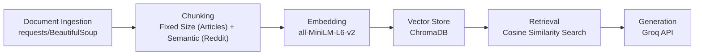

# Project 1 Planning: The Unofficial Guide

> Write this document before you write any pipeline code.
> Your spec and architecture diagram are what you'll use to direct AI tools (Claude, Copilot, etc.) to generate your implementation — the more specific they are, the more useful the generated code will be.
> Update the Retrieval Approach and Chunking Strategy sections if you change your approach during implementation.
> Update this file before starting any stretch features.

---

## Domain

<!-- What domain did you choose? Why is this knowledge valuable and hard to find through official channels? -->

This system focuses on making student-generated advice for surviving UC Berkeley accessible to the user. It doesn't focus on specific class/professor information but on lifestyle and mindset tips that are not general but specific to what works best for the unique UC Berkeley environment. It is often difficult to access through official channels because they reflect the more private thoughts/experiences of students and this tends to be scattered across different sources (reddit, blogs, articles, forums, etc.) which this project aims to consolidate.   

---

## Documents

<!-- List your specific sources: URLs, subreddit names, forum threads, or file descriptions.
     Aim for at least 10 sources that together cover different subtopics or perspectives within your domain. -->

| # | Source | Description | URL or location |
|---|--------|-------------|-----------------|
| 1 | Her Campus| An online platform designed for and by college women. This article in particular is written by a student writer from the Her Campus at UC Berkeley chapter.| https://www.hercampus.com/school/uc-berkeley/uc-berkeley-college-survival-guide/|
| 2 | The Daily Californian | A survival guide written by a UC Berkeley student in the campus newspaper, geared towards focusing on student physical/mental needs.| https://www.dailycal.org/archives/uc-berkeley-survival-guide-for-newer-students/article_5664df0b-aa7e-5076-8a5a-17be645aa5a9.html |
| 3 | Plexuss.com | A student network site that features various survival guides such as this one. | https://plexuss.com/n/uc-berkeley-college-survival-guide |
| 4 | The Daily Californian | Written by a different student, a survival guide on different habits/attitudes to have to be a successful student. | https://www.dailycal.org/archives/stay-motivated-a-uc-berkeley-survival-guide/article_f2a640cd-ea05-5e97-859d-e470df9401ae.html |
| 5 | Berkeley Subreddit| Titled "What should every new Cal student know about before they come to campus this Fall?" has advice from older students that they wish they knew starting their journey. | https://www.reddit.com/r/berkeley/comments/1dqccmk/what_should_every_new_cal_student_know_about/|
| 6 | Berkeley Subreddit| Titled "Mental health resource guide and a student-to-student survival guide <3"| https://www.reddit.com/r/berkeley/comments/16hgeb0/mental_health_resource_guide_and_a/|
| 7 | Berkeley Subreddit| Has information about the geography of Berkeley and how to be physically safe.| https://www.reddit.com/r/berkeley/comments/15njiw6/what_is_essential_to_haveknow_when_living_in/|
| 8 | Berkeley Subreddit| Specific to the popular EECS major, some information on how to navigate the challenging courses and acadmic pressures.| https://www.reddit.com/r/berkeley/comments/25kp1d/how_to_survive_berkeley_eecs/|
| 9 | Berkeley Subreddit| Advice specific on exams and finals. How to study when cramming.|https://www.reddit.com/r/berkeley/comments/13c6atg/guide_to_maximizing_your_score_on_your_finals_if/ |
| 10 | Berkeley Subreddit| "How to Succeed at Berkeley," tips for navigating the academic life at Cal.| https://www.reddit.com/r/berkeley/comments/pfa2j3/how_to_succeed_at_berkeley/|

---

## Chunking Strategy

<!-- How will you split documents into chunks?
     State your chunk size (in tokens or characters), overlap size, and explain why those
     numbers fit the structure of your documents.
     A review-heavy corpus warrants different chunking than a long FAQ. -->

**Chunk size:**
I will implement an adaptive chunking strategy: based on the type of source (article vs. forum) chunk accordingly. I will chunk ~450 tokens for the articles and one commment per chunk for Reddit. 

**Overlap:**
75 tokens for articles and 0 for Reddit.

**Reasoning:**
Articles are continuous so ideas can span multiple chunks, so overlap prevents retrieval gaps at the chunk boundaries. Each Reddit comment is already a distinct chunk so overlapping them is unnecessary.

---

## Retrieval Approach

<!-- Which embedding model are you using (e.g., all-MiniLM-L6-v2 via sentence-transformers)?
     How many chunks will you retrieve per query (top-k)?
     If you were deploying this for real users and cost wasn't a constraint, what tradeoffs
     would you weigh in choosing a different embedding model — context length, multilingual
     support, accuracy on domain-specific text, latency? -->

**Embedding model:**
all-MiniLM-L6-v2 (handles conversational text quickly and accurately)

**Top-k:**
3 (since there is a relatively small amount of context from all these sources, anything greater than 3 would likely be distant chunks)

**Production tradeoff reflection:**
If I was deploying this for real users, I would consider how some embedding models cap at 256 tokens, effectively cutting off longer chunks. If I had long documents, a model that handles more tokens would be more suitable. multi-qa-MiniLM-L6-cos-v1 is trained specifically on question/passage pairs and would likely outperform a general-purpose model on Q&A tasks, so this is something else I would consider. Domain-specificity is something I wouldn't consider as much as models are tailored towards highly specialized fields like medicine or law but student advice can be handled by general models. I would also use an embedding model like paraphrase-multilingual-MiniLM-L12-v2 for users to be able to query in a language other than english but this would likely decrease the accuracy on English only queries. 

---

## Evaluation Plan

<!-- List your 5 test questions with their expected correct answers.
     Questions should be specific enough that you can judge whether the system's response
     is right or wrong. "What are good dining halls?" is too vague.
     "What do students say about wait times at [dining hall name] during lunch?" is testable. -->

| # | Question | Expected answer |
|---|----------|-----------------|
| 1 | If studying EECS, how many technical classes is it recommended to take each semester?| Students recommend taking no more than 2 technical courses per semester in lower division, especially in the first year. The advice warns against stacking CS 61A, 61B, CS 70, and math courses simultaneously, as each requires significantly more time than expected.|
| 2 | What free or discounted perks do students say Berkeley students should take advantage of?| Free HBO Max for students living in the dorms, and the Cal football/basketball student pass, noting it's good value, tickets can be resold, and it's a social activity|
| 3 |What do Berkeley students recommend for managing mental health when feeling overwhelmed, and what campus resources do they mention by name?	| Students recommend reaching out to CAPS (Counseling and Psychological Services), the Tang Center/UHS, and peer counseling programs. They also emphasize setting boundaries on studying, staying socially connected, and normalizing asking for help given Berkeley's high-pressure environment.|
| 4 |What specific support offices or student services do Berkeley survival guides recommend visiting within your first month on campus? | Within the first month, students recommend visiting the Student Learning Center (SLC) for academic support, the Career Center to start thinking about internships early, the Tang Center and Financial Aid office for health and financial resources, and RSSP for housing-related needs.|
| 5 | What areas or neighborhoods around Berkeley do students say are unsafe to walk through at night?| Students flag areas around People's Park, Telegraph Ave south of campus, and the Downtown Berkeley/Oakland border as higher-risk after dark. They recommend using the Night Safety Shuttle (Bear Transit), the campus escort service, and avoiding walking alone late at night.
|

---

## Anticipated Challenges

<!-- What could go wrong? Name at least two specific risks with reasoning.
     Consider: noisy or inconsistent documents, missing source attribution, off-topic
     retrieval, chunks that split key information across boundaries. -->

1. Reddit comments without context. Each Reddit comment is chunked separateley, but many comments only make sense with the thread title as context. For example, saying "don't do that" isn't useful on its own without knowing what "that" refers to. 

2. Reddit comment noise. Reddit threads can have jokes and sarcasm that aren't helpful for answering user queries, but this will be difficult for the model to distinguish.

---

## Architecture

<!-- Draw a diagram of your pipeline showing the five stages:
     Document Ingestion → Chunking → Embedding + Vector Store → Retrieval → Generation
     Label each stage with the tool or library you're using.
     You can use ASCII art, a Mermaid diagram, or embed a sketch as an image.
     You'll use this diagram as context when prompting AI tools to implement each stage. -->

---

## AI Tool Plan

<!-- For each part of the pipeline below, describe:
     - Which AI tool you plan to use (Claude, Copilot, ChatGPT, etc.)
     - What you'll give it as input (which sections of this planning.md, which requirements)
     - What you expect it to produce
     - How you'll verify the output matches your spec

     "I'll use AI to help me code" is not a plan.
     "I'll give Claude my Chunking Strategy section and ask it to implement chunk_text()
     with my specified chunk size and overlap" is a plan. -->

**Milestone 3 — Ingestion and chunking:**
- Tool: Claude
- Input: The Documents section (source URLs), the Chunking Strategy section, and the pipeline diagram
- Expected output: An `ingest.py` that fetches each URL using `requests`/`BeautifulSoup` and saves the raw text, and a `chunk.py` with a `chunk_text()` function that applies 450-token fixed-size chunking with 75-token overlap for articles and one-comment-per-chunk for Reddit, with the thread title prepended to each Reddit chunk
- Verification: Run on one article source and one Reddit source, print the chunks, and manually confirm article chunks are ~450 tokens with overlap and Reddit chunks are one comment each with the thread title attached

**Milestone 4 — Embedding and retrieval:**
- Tool: Claude
- Input: The Retrieval Approach section, the architecture diagram, and the pipeline diagram
- Expected output: An `embed.py` that loads chunks, embeds them using `all-MiniLM-L6-v2` via `sentence-transformers`, and stores them in ChromaDB; and a `retrieve.py` with a `retrieve(query, k=3)` function that returns the top-3 most similar chunks using cosine similarity
- Verification: Run the 5 evaluation questions through `retrieve()` and manually check that the returned chunks are topically relevant to each question

**Milestone 5 — Generation and interface:**
- Tool: Claude
- Input: The Retrieval Approach section, the Evaluation Plan section, and the pipeline diagram
- Expected output: A `generate.py` that passes retrieved chunks as context to the Groq API and returns a grounded answer, plus a Gradio interface with a text input and response display
- Verification: Run all 5 evaluation questions through the full pipeline end-to-end and compare responses against the expected answers in the Evaluation Plan
